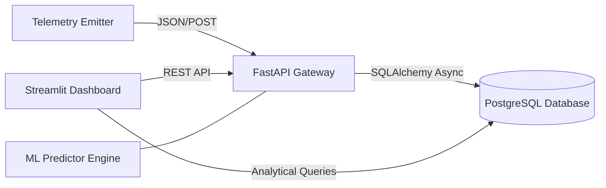

# GreenAI: Real-Time Telemetry & Predictive Carbon Audit


A professional-grade microservices pipeline designed to monitor, audit, and forecast the carbon footprint of high-performance computing (HPC) workloads. This project demonstrates the integration of hardware-level telemetry with asynchronous data processing and predictive analytics.

***

## Technical Overview

The system architecture implements a reactive data pipeline that ingests real-time power metrics from edge devices, stores them in a structured relational database, and provides a live analytical interface for carbon auditing.

### System Architecture



## Database Schema
The project utilizes a Star Schema design to optimize analytical queries between real-time telemetry and static hardware metadata.

| Table | Type | Description | Key Columns |
| :--- | :--- | :--- | :--- |
| **fact_compute_logs** | Fact | Time-series telemetry from GPUs | `timestamp`, `power_draw_watts`, `hardware_id` |
| **dim_hardware** | Dimension | Static hardware specifications | `hardware_id`, `name`, `tdp_watts` |

## Core Functionalities

- **Predictive Impact Forecasting:** Utilizes historical power draw trends to calculate the projected carbon footprint of future compute jobs via an integrated inference engine.
- **Hardware Utilization Monitoring:** Real-time analysis of Thermal Design Power (TDP) saturation to identify hardware under-utilization or thermal inefficiencies.
- **Carbon-Aware Analytics:** Translates raw wattage into kgCO2 metrics based on regional grid intensity factors.
- **Scalable Microservices:** Fully containerized stack using Docker Compose to ensure deployment consistency across development and production environments.

## Technology Stack

- **Backend:** FastAPI (Asynchronous Python Framework)
- **Frontend:** Streamlit (Reactive Data Dashboard)
- **Database:** PostgreSQL (Relational Star Schema)
- **Infrastructure:** Docker, Docker Compose
- **ORM:** SQLAlchemy (Asyncio)
- **Predictive Logic:** Weighted Temporal Average Modeling

## Installation & Deployment

### 1. Initialize Environment

Ensure Docker and Docker Compose are installed on the host machine.

### 2. Deploy Stack

```bash
docker compose up --build -d
```

### 3. Telemetry Simulation

To simulate a live hardware workload, execute the provided telemetry emitter:

```bash
python test_emitter.py
```

## Analytical Impact

By providing granular visibility into power consumption, this platform enables organizations to optimize machine learning training schedules for carbon neutrality. The integration of predictive modeling allows for proactive workload shifting, reducing the environmental footprint of large-scale computational experiments.